> ⚠️ Este README es generado automáticamente mediante GitHub Actions.  
> Cualquier cambio manual será sobrescrito.

# BasePage Automation
Clase reutilizable que contiene métodos para interactuar con elementos DOM de una página web.


## Web utilizada
Para los test estoy usando la página web: https://demoqa.com/ como sandbox.

---
<!-- TREE:START -->
## 📁 Estructura del proyecto

```
src/test/java/
├── driverManager
│   └── DriverManager.java
├── hooks
│   └── Hooks.java
├── model
│   └── UserData.java
├── pages
│   ├── BasePage.java
│   └── DemoQA.java
├── runner
│   └── TestRunner.java
└── steps
    └── InteractDemoQA.java

src/test/resources/
└── features
    └── interactDemoQA.feature
```

<!-- TREE:END -->

<!-- MERMAID:START -->
## 🔗 Relación Scenario → Métodos

```mermaid
flowchart TD
    feat_Interact_with_the_sandbox_page_https_demoqa_com_["Feature: Interact with the sandbox page https://demoqa.com/"]
    sc_Interact_with_the_sandbox_page_https_demoqa_com__The_user_can_fill_section_Te["Feature | Scenario: The user can fill section Text Box and click the button Submit"]
    feat_Interact_with_the_sandbox_page_https_demoqa_com_ --> sc_Interact_with_the_sandbox_page_https_demoqa_com__The_user_can_fill_section_Te
    st_The_user_can_fill_section_Text_Box_and_click_the_button_Submit_the_user_go_to["Step | @Given: theUserGoToThePageDemoQa()"]
    sc_Interact_with_the_sandbox_page_https_demoqa_com__The_user_can_fill_section_Te --> st_The_user_can_fill_section_Text_Box_and_click_the_button_Submit_the_user_go_to
    pm_GoToThePageDemoQa["Page | DemoQA: GoToThePageDemoQa()"]
    st_The_user_can_fill_section_Text_Box_and_click_the_button_Submit_the_user_go_to --> pm_GoToThePageDemoQa
    bp_navigateTo["Page | BasePage: navigateTo()"]
    pm_GoToThePageDemoQa --> bp_navigateTo
    st_The_user_can_fill_section_Text_Box_and_click_the_button_Submit_click_on_the_e["Step | @When: clickOnTheElementsSection()"]
    sc_Interact_with_the_sandbox_page_https_demoqa_com__The_user_can_fill_section_Te --> st_The_user_can_fill_section_Text_Box_and_click_the_button_Submit_click_on_the_e
    pm_clickOnElementsSection["Page | DemoQA: clickOnElementsSection()"]
    st_The_user_can_fill_section_Text_Box_and_click_the_button_Submit_click_on_the_e --> pm_clickOnElementsSection
    bp_click["Page | BasePage: click()"]
    pm_clickOnElementsSection --> bp_click
    st_The_user_can_fill_section_Text_Box_and_click_the_button_Submit_click_on_the_t["Step | @And: clickOnTheTextBoxAccordionOption()"]
    sc_Interact_with_the_sandbox_page_https_demoqa_com__The_user_can_fill_section_Te --> st_The_user_can_fill_section_Text_Box_and_click_the_button_Submit_click_on_the_t
    pm_clickOnAccordionTextBoxOption["Page | DemoQA: clickOnAccordionTextBoxOption()"]
    st_The_user_can_fill_section_Text_Box_and_click_the_button_Submit_click_on_the_t --> pm_clickOnAccordionTextBoxOption
    pm_clickOnAccordionTextBoxOption --> bp_click
    st_The_user_can_fill_section_Text_Box_and_click_the_button_Submit_fill_textboxes["Step | @And: fillTextboxesOnThePage()"]
    sc_Interact_with_the_sandbox_page_https_demoqa_com__The_user_can_fill_section_Te --> st_The_user_can_fill_section_Text_Box_and_click_the_button_Submit_fill_textboxes
    pm_fillTextboxes["Page | DemoQA: fillTextboxes()"]
    st_The_user_can_fill_section_Text_Box_and_click_the_button_Submit_fill_textboxes --> pm_fillTextboxes
    bp_setValueOnWebElement["Page | BasePage: setValueOnWebElement()"]
    pm_fillTextboxes --> bp_setValueOnWebElement
    st_The_user_can_fill_section_Text_Box_and_click_the_button_Submit_click_the_butt["Step | @And: clickTheButtonSubmit()"]
    sc_Interact_with_the_sandbox_page_https_demoqa_com__The_user_can_fill_section_Te --> st_The_user_can_fill_section_Text_Box_and_click_the_button_Submit_click_the_butt
    pm_clickOnButtonSubmit["Page | DemoQA: clickOnButtonSubmit()"]
    st_The_user_can_fill_section_Text_Box_and_click_the_button_Submit_click_the_butt --> pm_clickOnButtonSubmit
    pm_clickOnButtonSubmit --> bp_click
    st_The_user_can_fill_section_Text_Box_and_click_the_button_Submit_can_confirm_hi["Step | @Then: canConfirmHisInformationInTheOutputSection()"]
    sc_Interact_with_the_sandbox_page_https_demoqa_com__The_user_can_fill_section_Te --> st_The_user_can_fill_section_Text_Box_and_click_the_button_Submit_can_confirm_hi
    pm_getInformationOfOutput["Page | DemoQA: getInformationOfOutput()"]
    st_The_user_can_fill_section_Text_Box_and_click_the_button_Submit_can_confirm_hi --> pm_getInformationOfOutput
    bp_getTextWebElement["Page | BasePage: getTextWebElement()"]
    pm_getInformationOfOutput --> bp_getTextWebElement
    pm_assertEquals["Page | Page: assertEquals()"]
    st_The_user_can_fill_section_Text_Box_and_click_the_button_Submit_can_confirm_hi --> pm_assertEquals
style feat_Interact_with_the_sandbox_page_https_demoqa_com_ fill:#7E22CE,color:#fff,stroke:#fff
style sc_Interact_with_the_sandbox_page_https_demoqa_com__The_user_can_fill_section_Te fill:#7E22CE,color:#fff,stroke:#fff
style st_The_user_can_fill_section_Text_Box_and_click_the_button_Submit_the_user_go_to fill:#15803D,color:#fff,stroke:#fff
style pm_GoToThePageDemoQa fill:#1D4ED8,color:#fff,stroke:#fff
style bp_navigateTo fill:#0F172A,color:#fff,stroke:#fff
style st_The_user_can_fill_section_Text_Box_and_click_the_button_Submit_click_on_the_e fill:#15803D,color:#fff,stroke:#fff
style pm_clickOnElementsSection fill:#1D4ED8,color:#fff,stroke:#fff
style bp_click fill:#0F172A,color:#fff,stroke:#fff
style st_The_user_can_fill_section_Text_Box_and_click_the_button_Submit_click_on_the_t fill:#15803D,color:#fff,stroke:#fff
style pm_clickOnAccordionTextBoxOption fill:#1D4ED8,color:#fff,stroke:#fff
style st_The_user_can_fill_section_Text_Box_and_click_the_button_Submit_fill_textboxes fill:#15803D,color:#fff,stroke:#fff
style pm_fillTextboxes fill:#1D4ED8,color:#fff,stroke:#fff
style bp_setValueOnWebElement fill:#0F172A,color:#fff,stroke:#fff
style st_The_user_can_fill_section_Text_Box_and_click_the_button_Submit_click_the_butt fill:#15803D,color:#fff,stroke:#fff
style pm_clickOnButtonSubmit fill:#1D4ED8,color:#fff,stroke:#fff
style st_The_user_can_fill_section_Text_Box_and_click_the_button_Submit_can_confirm_hi fill:#15803D,color:#fff,stroke:#fff
style pm_getInformationOfOutput fill:#1D4ED8,color:#fff,stroke:#fff
style bp_getTextWebElement fill:#0F172A,color:#fff,stroke:#fff
style pm_assertEquals fill:#1D4ED8,color:#fff,stroke:#fff
```



<!-- MERMAID:END -->

<!-- METHODS:START -->
## 📋 Métodos disponibles (9)

| Clase | Visibilidad | Método | Descripción | Parámetros | Retorna | # Usos |
|-------|-------------|--------|-------------|------------|---------|--------|
| `BasePage.java` | `private` | `getWebElementPresent()` | Espera a que un elemento esté presente en el DOM y lo retorna | `String locator`: XPath del elemento a buscar | WebElement encontrado en el DOM | **2** |
| `BasePage.java` | `private` | `getWebElementClickable()` | Espera a que un elemento esté disponible para hacer click en el DOM y lo retorna | `String locator`: XPath del elemento a buscar | WebElement encontrado en el DOM | **2** |
| `BasePage.java` | `private` | `getOptionsSelect()` | Genera una lista de WebElements en base al Select del DOM y lo retorna | `String locator`: XPath del Select a extraer las opciones | List<WebElement> armado con las opciones | **1** |
| `BasePage.java` | `public` | `navigateTo()` | Ingresa a URL en el navegador | `String url`: Dirección web a la cual queremos dirigirnos | — | **1** |
| `BasePage.java` | `public` | `click()` | Hace click en el locator indicado | `String locator`: XPath del locator que queremos hacerle click | — | **3** |
| `BasePage.java` | `public` | `getTextWebElement()` | Obtiene el texto de un elemento web del DOM | `String locator`: XPath del locator que queremos su texto | String del texto en base al locator | **1** |
| `BasePage.java` | `public` | `setValueOnWebElement()` | Escribir texto en el elemento web del DOM | `String locator`: XPath del locator que queremos escribir<br>`String value`: Texto que queremos escribir | — | **1** |
| `BasePage.java` | `public` | `getListOptionsSelect()` | Genera una lista de Strings en base al Select del DOM y lo retorna | `String locator`: XPath del Select a extraer las opciones | List<String> armado con las opciones | 0 |
| `BasePage.java` | `public` | `selectOption()` | Selecciona una opción dentro de un Select de un elemento Web | `String locator`: XPath del Select para elegir la opción<br>`String option`: String que indica la opción que vamos a elegir en el Select | — | 0 |

<!-- METHODS:END -->


