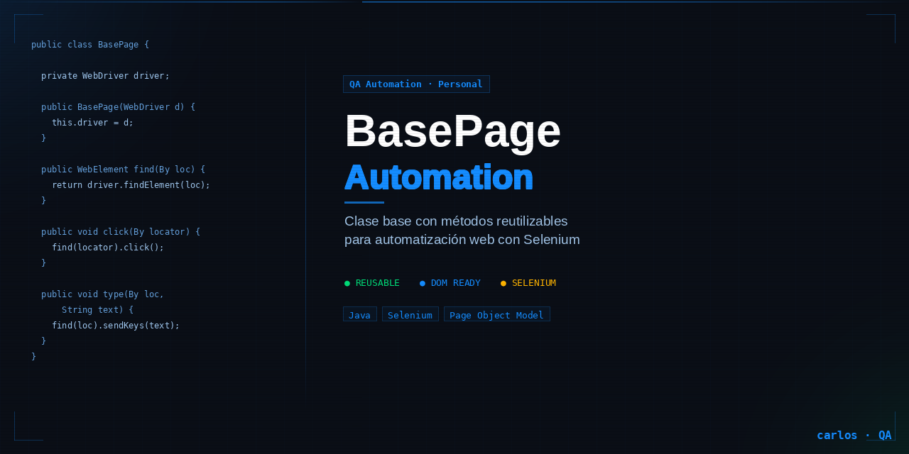

> ⚠️ Este README es generado automáticamente mediante GitHub Actions.  
> Cualquier cambio manual será sobrescrito.

# BasePage Automation
Clase reutilizable que contiene métodos para interactuar con elementos DOM de una página web.


## Web utilizada
Para los test estoy usando la página web: https://demoqa.com/ como sandbox.

---
<!-- TREE:START -->
## 📁 Estructura del proyecto

```
src/test/java/
├── driverManager
│   └── DriverManager.java
├── hooks
│   └── Hooks.java
├── model
│   ├── CheckboxChildren.java
│   ├── CheckboxParent.java
│   └── UserData.java
├── pages
│   ├── alertFrame
│   │   ├── AlertsPage.java
│   │   ├── AlertsWindowsPage.java
│   │   ├── BrowserWindowsPage.java
│   │   ├── FramesPage.java
│   │   ├── ModalDialogPage.java
│   │   └── NestedFramesPage.java
│   ├── bookStoreApplication
│   │   ├── BooksPage.java
│   │   ├── BookStoreApiPage.java
│   │   ├── BookStorePage.java
│   │   ├── LoginPage.java
│   │   └── ProfilePage.java
│   ├── elements
│   │   ├── BrokenLinksPage.java
│   │   ├── ButtonsPage.java
│   │   ├── CheckboxPage.java
│   │   ├── DynamicPropertiesPage.java
│   │   ├── ElementsPage.java
│   │   ├── LinksPage.java
│   │   ├── RadioButtonPage.java
│   │   ├── TextBoxPage.java
│   │   ├── UploadDownloadPage.java
│   │   └── WebTablesPage.java
│   ├── forms
│   │   ├── FormsPage.java
│   │   └── PracticeForm.java
│   ├── interactions
│   │   ├── DragabblePage.java
│   │   ├── DroppablePage.java
│   │   ├── InteractionPage.java
│   │   ├── ResizablePage.java
│   │   ├── SelectablePage.java
│   │   └── SortablePage.java
│   ├── widgets
│   │   ├── AccordianPage.java
│   │   ├── AutoCompletePage.java
│   │   ├── DatePickerPage.java
│   │   ├── MenuPage.java
│   │   ├── ProgressBarPage.java
│   │   ├── SelectMenuPage.java
│   │   ├── SliderPage.java
│   │   ├── TabsPage.java
│   │   ├── TooltipsPage.java
│   │   └── WidgetsPage.java
│   ├── BasePage.java
│   └── HomePage.java
├── runner
│   └── TestRunner.java
└── steps
    ├── CheckBoxSteps.java
    ├── NavigationSteps.java
    └── TextboxSteps.java

src/test/resources/
└── features
    ├── business
    │   ├── checkbox.feature
    │   └── textbox.feature
    └── internal
        └── checkboxInternal.feature
```

<!-- TREE:END -->

<!-- MERMAID:START -->
## 🔗 Relación Scenario → Métodos

```mermaid
flowchart TD
    feat_Interact_with_the_checkbox_sandbox_page["Feature: Interact with the checkbox sandbox page"]
    feat_Interact_with_the_textbox_sandbox_page["Feature: Interact with the textbox sandbox page"]
    sc_Interact_with_the_textbox_sandbox_page_The_user_can_fill_section_Text_Box_and["Feature | Scenario: The user can fill section Text Box and click the button Submit"]
    feat_Interact_with_the_textbox_sandbox_page --> sc_Interact_with_the_textbox_sandbox_page_The_user_can_fill_section_Text_Box_and
    st_The_user_can_fill_section_Text_Box_and_click_the_button_Submit_fill_textboxes["Step | @And: fillTextboxesOnThePage()"]
    sc_Interact_with_the_textbox_sandbox_page_The_user_can_fill_section_Text_Box_and --> st_The_user_can_fill_section_Text_Box_and_click_the_button_Submit_fill_textboxes
    pm_fillTextboxes["Page | TextBoxPage: fillTextboxes()"]
    st_The_user_can_fill_section_Text_Box_and_click_the_button_Submit_fill_textboxes --> pm_fillTextboxes
    bp_setValueOnWebElement["Page | BasePage: setValueOnWebElement()"]
    pm_fillTextboxes --> bp_setValueOnWebElement
    st_The_user_can_fill_section_Text_Box_and_click_the_button_Submit_click_the_butt["Step | @And: clickTheButtonSubmit()"]
    sc_Interact_with_the_textbox_sandbox_page_The_user_can_fill_section_Text_Box_and --> st_The_user_can_fill_section_Text_Box_and_click_the_button_Submit_click_the_butt
    pm_clickOnButtonSubmit["Page | TextBoxPage: clickOnButtonSubmit()"]
    st_The_user_can_fill_section_Text_Box_and_click_the_button_Submit_click_the_butt --> pm_clickOnButtonSubmit
    bp_click["Page | BasePage: click()"]
    pm_clickOnButtonSubmit --> bp_click
    st_The_user_can_fill_section_Text_Box_and_click_the_button_Submit_can_confirm_hi["Step | @Then: canConfirmHisInformationInTheOutputSection()"]
    sc_Interact_with_the_textbox_sandbox_page_The_user_can_fill_section_Text_Box_and --> st_The_user_can_fill_section_Text_Box_and_click_the_button_Submit_can_confirm_hi
    pm_getInformationOfOutput["Page | TextBoxPage: getInformationOfOutput()"]
    st_The_user_can_fill_section_Text_Box_and_click_the_button_Submit_can_confirm_hi --> pm_getInformationOfOutput
    bp_getTextWebElement["Page | BasePage: getTextWebElement()"]
    pm_getInformationOfOutput --> bp_getTextWebElement
    pm_assertEquals["Page | Page: assertEquals()"]
    st_The_user_can_fill_section_Text_Box_and_click_the_button_Submit_can_confirm_hi --> pm_assertEquals
    pm_assertAll["Page | Page: assertAll()"]
    st_The_user_can_fill_section_Text_Box_and_click_the_button_Submit_can_confirm_hi --> pm_assertAll
    sc_Interact_with_the_textbox_sandbox_page_The_user_don_t_fill_email_textbox_clic["Feature | Scenario: The user don't fill email textbox click the button Submit"]
    feat_Interact_with_the_textbox_sandbox_page --> sc_Interact_with_the_textbox_sandbox_page_The_user_don_t_fill_email_textbox_clic
    st_The_user_don_t_fill_email_textbox_click_the_button_Submit_fill_partial_the_em["Step | @And: fillPartialTheEmailTextboxOnThePage()"]
    sc_Interact_with_the_textbox_sandbox_page_The_user_don_t_fill_email_textbox_clic --> st_The_user_don_t_fill_email_textbox_click_the_button_Submit_fill_partial_the_em
    st_The_user_don_t_fill_email_textbox_click_the_button_Submit_fill_partial_the_em --> pm_fillTextboxes
    st_The_user_don_t_fill_email_textbox_click_the_button_Submit_click_the_button_Su["Step | @And: clickTheButtonSubmit()"]
    sc_Interact_with_the_textbox_sandbox_page_The_user_don_t_fill_email_textbox_clic --> st_The_user_don_t_fill_email_textbox_click_the_button_Submit_click_the_button_Su
    st_The_user_don_t_fill_email_textbox_click_the_button_Submit_click_the_button_Su --> pm_clickOnButtonSubmit
    st_The_user_don_t_fill_email_textbox_click_the_button_Submit_can_confirm_the_ema["Step | @Then: canConfirmTheEmailValidationMessage()"]
    sc_Interact_with_the_textbox_sandbox_page_The_user_don_t_fill_email_textbox_clic --> st_The_user_don_t_fill_email_textbox_click_the_button_Submit_can_confirm_the_ema
    pm_getValidationMessageWebElement["Page | TextBoxPage: getValidationMessageWebElement()"]
    st_The_user_don_t_fill_email_textbox_click_the_button_Submit_can_confirm_the_ema --> pm_getValidationMessageWebElement
    bp_getValidationMessageWebElement["Page | BasePage: getValidationMessageWebElement()"]
    pm_getValidationMessageWebElement --> bp_getValidationMessageWebElement
    pm_println["Page | Page: println()"]
    st_The_user_don_t_fill_email_textbox_click_the_button_Submit_can_confirm_the_ema --> pm_println
    pm_isEmpty["Page | Page: isEmpty()"]
    st_The_user_don_t_fill_email_textbox_click_the_button_Submit_can_confirm_the_ema --> pm_isEmpty
    pm_assertTrue["Page | Page: assertTrue()"]
    st_The_user_don_t_fill_email_textbox_click_the_button_Submit_can_confirm_the_ema --> pm_assertTrue
    feat_Internal_test_for_methods["Feature: Internal test for methods"]
    sc_Internal_test_for_methods_Changing_states_for_checkboxes["Feature | Scenario: Changing states for checkboxes"]
    feat_Internal_test_for_methods --> sc_Internal_test_for_methods_Changing_states_for_checkboxes
    st_Changing_states_for_checkboxes_the_parent_is_initial_state_state["Step | @Step: the <parent> is '<initial_state>' state"]
    sc_Internal_test_for_methods_Changing_states_for_checkboxes --> st_Changing_states_for_checkboxes_the_parent_is_initial_state_state
    st_Changing_states_for_checkboxes_the_parent_change_to_final_state_state["Step | @Step: the <parent> change to '<final_state>' state"]
    sc_Internal_test_for_methods_Changing_states_for_checkboxes --> st_Changing_states_for_checkboxes_the_parent_change_to_final_state_state
style feat_Interact_with_the_checkbox_sandbox_page fill:#7E22CE,color:#fff,stroke:#fff
style feat_Interact_with_the_textbox_sandbox_page fill:#7E22CE,color:#fff,stroke:#fff
style sc_Interact_with_the_textbox_sandbox_page_The_user_can_fill_section_Text_Box_and fill:#7E22CE,color:#fff,stroke:#fff
style st_The_user_can_fill_section_Text_Box_and_click_the_button_Submit_fill_textboxes fill:#15803D,color:#fff,stroke:#fff
style pm_fillTextboxes fill:#1D4ED8,color:#fff,stroke:#fff
style bp_setValueOnWebElement fill:#0F172A,color:#fff,stroke:#fff
style st_The_user_can_fill_section_Text_Box_and_click_the_button_Submit_click_the_butt fill:#15803D,color:#fff,stroke:#fff
style pm_clickOnButtonSubmit fill:#1D4ED8,color:#fff,stroke:#fff
style bp_click fill:#0F172A,color:#fff,stroke:#fff
style st_The_user_can_fill_section_Text_Box_and_click_the_button_Submit_can_confirm_hi fill:#15803D,color:#fff,stroke:#fff
style pm_getInformationOfOutput fill:#1D4ED8,color:#fff,stroke:#fff
style bp_getTextWebElement fill:#0F172A,color:#fff,stroke:#fff
style pm_assertEquals fill:#1D4ED8,color:#fff,stroke:#fff
style pm_assertAll fill:#1D4ED8,color:#fff,stroke:#fff
style sc_Interact_with_the_textbox_sandbox_page_The_user_don_t_fill_email_textbox_clic fill:#7E22CE,color:#fff,stroke:#fff
style st_The_user_don_t_fill_email_textbox_click_the_button_Submit_fill_partial_the_em fill:#15803D,color:#fff,stroke:#fff
style st_The_user_don_t_fill_email_textbox_click_the_button_Submit_click_the_button_Su fill:#15803D,color:#fff,stroke:#fff
style st_The_user_don_t_fill_email_textbox_click_the_button_Submit_can_confirm_the_ema fill:#15803D,color:#fff,stroke:#fff
style pm_getValidationMessageWebElement fill:#1D4ED8,color:#fff,stroke:#fff
style bp_getValidationMessageWebElement fill:#0F172A,color:#fff,stroke:#fff
style pm_println fill:#1D4ED8,color:#fff,stroke:#fff
style pm_isEmpty fill:#1D4ED8,color:#fff,stroke:#fff
style pm_assertTrue fill:#1D4ED8,color:#fff,stroke:#fff
style feat_Internal_test_for_methods fill:#7E22CE,color:#fff,stroke:#fff
style sc_Internal_test_for_methods_Changing_states_for_checkboxes fill:#7E22CE,color:#fff,stroke:#fff
style st_Changing_states_for_checkboxes_the_parent_is_initial_state_state fill:#15803D,color:#fff,stroke:#fff
style st_Changing_states_for_checkboxes_the_parent_change_to_final_state_state fill:#15803D,color:#fff,stroke:#fff
```



<!-- MERMAID:END -->

<!-- METHODS:START -->
## 📋 Métodos disponibles (15)

| Clase | Visibilidad | Método | Descripción | Parámetros | Retorna | # Usos |
|-------|-------------|--------|-------------|------------|---------|--------|
| `BasePage.java` | `private` | `getWebElementPresent()` | Espera a que un elemento esté presente en el DOM y lo retorna | `String locator`: XPath del elemento a buscar | WebElement encontrado en el DOM | **4** |
| `BasePage.java` | `private` | `getWebElementClickable()` | Espera a que un elemento esté disponible para hacer click en el DOM y lo retorna | `String locator`: XPath del elemento a buscar | WebElement encontrado en el DOM | **2** |
| `BasePage.java` | `private` | `getOptionsSelect()` | Genera una lista de WebElements en base al Select del DOM y lo retorna | `String locator`: XPath del Select a extraer las opciones | List<WebElement> armado con las opciones | **1** |
| `BasePage.java` | `private` | `isLocatorPresent()` | Nos dice si un locator está presente | `String locator`: XPath del elemento web que queremos buscar | boolean true si está, caso contrario false | **2** |
| `BasePage.java` | `public` | `navigateTo()` | Ingresa a URL en el navegador | `String url`: Dirección web a la cual queremos dirigirnos | — | **1** |
| `BasePage.java` | `public` | `click()` | Hace click en el locator indicado | `String locator`: XPath del locator que queremos hacerle click | — | **45** |
| `BasePage.java` | `public` | `getTextWebElement()` | Obtiene el texto de un elemento web del DOM | `String locator`: XPath del locator que queremos su texto | String del texto en base al locator | **1** |
| `BasePage.java` | `public` | `setValueOnWebElement()` | Escribir texto en el elemento web del DOM | `String locator`: XPath del locator que queremos escribir<br>`String value`: Texto que queremos escribir | — | **1** |
| `BasePage.java` | `public` | `getListOptionsSelect()` | Genera una lista de Strings en base al Select del DOM y lo retorna | `String locator`: XPath del Select a extraer las opciones | List<String> armado con las opciones | 0 |
| `BasePage.java` | `public` | `selectOption()` | Selecciona una opción dentro de un Select de un elemento Web | `String locator`: XPath del Select para elegir la opción<br>`String option`: String que indica la opción que vamos a elegir en el Select | — | 0 |
| `BasePage.java` | `public` | `getValidationMessageWebElement()` | Extrae el tooltip de mensaje de validación que nos devuelve un elemento web | `String locator`: XPath del elemento web para extraer el tooltip | String texto del tooltip | **1** |
| `BasePage.java` | `public` | `getStateOfCheckbox()` | Devuelve el estado de un checkbox: seleccionado, no seleccionado o indeterminado | `String locator`: XPath del elemento web checkbox | String estado del checkbox | **6** |
| `BasePage.java` | `public` | `clickAll()` | Hace click en todos los locators que encuentre con ese xpath | `String locator`: XPath de los locators que queremos hacerle click | — | **1** |
| `BasePage.java` | `public` | `openAllCloseSwitcher()` | Abre todos los switcher + cerrados visualizados en la página | `String locator`: XPath del elemento web switcher | — | **1** |
| `BasePage.java` | `public` | `generateRandomNumber()` | Genera un número aleatorio | `int max`: número máximo para la generación | int número aleatorio generado | **2** |

<!-- METHODS:END -->


